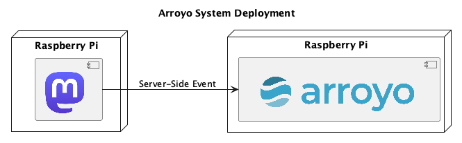

# Big Data - Semester 241

## Overview

In this project, we will do a Mastodon post processing, to monitor the US 2024 voting trends, based on post mentioning of the candidates.

Within this context, we assume a candidate approval is based on the number of post **contains the candidate name** as keyword.
This does not accommodate for the sentimental of the post (i.e, whether the post is positive or negative about the candidate).

## Deployment strategy

## SWOT analysis

### Strength

- Fast and lightweight (good enough).
- Built-in support for Kafka
- Lightweight

### Weakness

- "Battery not included":
  - Does not work natively with common databases: PostgreSQL, MySQL, ...
  - Should only work with "lightweight" connectors: WebSocket, MQTT, ...
- New, lack of supports from communities
- Lack of more-advanced query features:
  - Count number of substring occurrences

### Opportunities

- Deploy on edge or small performance devices: Raspberry Pi

### Threats

- Kafka Connect:
  - Kafka at the core
  - Many community-built connectors
  - Faster setup and deploy
- Apache Flink:
  - Popular, widely supported
